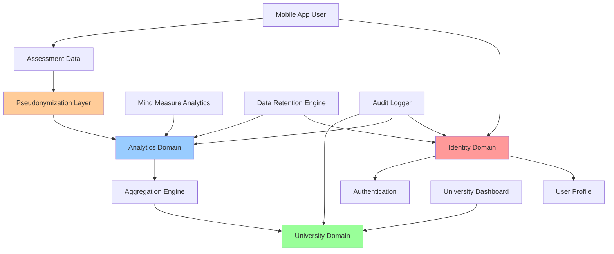

# Privacy-Compliant Data Architecture for Mind Measure

## Executive Summary

This document outlines Mind Measure's privacy-first data architecture designed to comply with HIPAA (US), UK GDPR, and ICO guidelines for medical/mental health data processing. The architecture ensures **complete anonymization** of user data for universities while maintaining analytical value.

## 🔒 Core Privacy Principles

### 1. Data Minimization
- Collect only necessary data for wellness assessment
- Separate identity from analytical data at collection point
- Automatic deletion of identifiable data after specified periods

### 2. Purpose Limitation
- **Mobile App**: User wellness tracking and personal insights
- **Universities**: Anonymous cohort analytics only
- **Mind Measure**: Service improvement via aggregated, anonymized data

### 3. Zero-Knowledge Architecture
- Universities cannot identify individual users
- Mind Measure cannot tie analytics to specific individuals
- Users maintain control over their personal data

## 🏥 Regulatory Compliance Framework

### HIPAA Compliance (US)

#### Technical Safeguards
- **Encryption**: AES-256 for data at rest, TLS 1.3 for data in transit
- **Access Controls**: Role-based access with minimum necessary principle
- **Audit Logs**: Comprehensive logging of all data access
- **De-identification**: Following 18 HIPAA identifiers removal

#### Administrative Safeguards
- **Business Associate Agreements**: Required for all third parties
- **Data Use Agreements**: Limiting university data usage
- **Incident Response**: 72-hour breach notification procedures

#### Physical Safeguards
- **Cloud Security**: SOC 2 Type II compliant infrastructure
- **Data Center Controls**: Restricted physical access

### UK GDPR Compliance

#### Lawful Basis
- **Consent**: Explicit opt-in for data processing
- **Legitimate Interest**: Anonymous analytics for service improvement
- **Public Interest**: Population health research (anonymized)

#### Data Subject Rights
- **Right to Access**: Users can export their personal data
- **Right to Rectification**: Profile data can be corrected
- **Right to Erasure**: Complete account deletion
- **Right to Portability**: Data export in machine-readable format
- **Right to Object**: Opt-out of analytics processing

#### UK-Specific Requirements
- **ICO Registration**: Data Protection Impact Assessment (DPIA)
- **Data Protection Officer**: Designated privacy contact
- **International Transfers**: Adequacy decisions for data processing

## 🏗️ Privacy-First Database Architecture

### Core Design Principles

1. **Identity Separation**: Personal identifiers stored separately from analytics data
2. **Pseudonymization**: Irreversible hashing for cross-table relationships
3. **Data Domains**: Separate schemas for identity, analytics, and university access
4. **Time-based Deletion**: Automatic removal of identifiable data

### Database Schema Design

```sql
-- DOMAIN 1: Identity Management (Mind Measure Only)
CREATE SCHEMA identity_domain;

-- User authentication and basic profile
CREATE TABLE identity_domain.users (
    id UUID PRIMARY KEY DEFAULT gen_random_uuid(),
    email TEXT UNIQUE NOT NULL,
    password_hash TEXT NOT NULL,
    created_at TIMESTAMP DEFAULT NOW(),
    last_login TIMESTAMP,
    -- Auto-deletion after 7 years of inactivity
    scheduled_deletion TIMESTAMP DEFAULT (NOW() + INTERVAL '7 years')
);

-- Personal information (deletable on request)
CREATE TABLE identity_domain.user_profiles (
    id UUID PRIMARY KEY DEFAULT gen_random_uuid(),
    user_id UUID REFERENCES identity_domain.users(id) ON DELETE CASCADE,
    first_name TEXT,
    last_name TEXT,
    display_name TEXT,
    avatar_url TEXT,
    university_code TEXT, -- For cohort assignment only
    consent_version TEXT NOT NULL,
    consent_timestamp TIMESTAMP NOT NULL,
    data_retention_preference TEXT DEFAULT '7_years', -- 1_year, 3_years, 7_years, indefinite
    created_at TIMESTAMP DEFAULT NOW(),
    updated_at TIMESTAMP DEFAULT NOW()
);

-- DOMAIN 2: Analytics (Pseudonymized)
CREATE SCHEMA analytics_domain;

-- Generate irreversible pseudonym for each user
CREATE TABLE analytics_domain.user_pseudonyms (
    id UUID PRIMARY KEY DEFAULT gen_random_uuid(),
    user_hash TEXT UNIQUE NOT NULL, -- SHA-256(user_id + salt + timestamp)
    university_code_hash TEXT, -- SHA-256(university_code + salt)
    cohort_hash TEXT, -- For grouping without identification
    created_month DATE, -- Month-level granularity only
    is_active BOOLEAN DEFAULT true
);

-- Assessment data linked to pseudonyms only
CREATE TABLE analytics_domain.assessment_sessions (
    id UUID PRIMARY KEY DEFAULT gen_random_uuid(),
    user_hash TEXT REFERENCES analytics_domain.user_pseudonyms(user_hash),
    session_type TEXT NOT NULL, -- 'baseline', 'checkin', 'voice'
    completion_status TEXT NOT NULL,
    mood_before_category TEXT, -- Categorical only: 'low', 'medium', 'high'
    mood_after_category TEXT,
    assessment_duration_minutes INTEGER,
    created_week DATE, -- Week-level granularity
    time_of_day TEXT -- 'morning', 'afternoon', 'evening'
);

-- Wellness scores (no direct user link)
CREATE TABLE analytics_domain.wellness_scores (
    id UUID PRIMARY KEY DEFAULT gen_random_uuid(),
    session_id UUID REFERENCES analytics_domain.assessment_sessions(id),
    score_category TEXT NOT NULL, -- 'improving', 'stable', 'concerning'
    confidence_level TEXT NOT NULL, -- 'low', 'medium', 'high'
    trend_direction TEXT, -- 'improving', 'declining', 'stable'
    created_week DATE
);

-- DOMAIN 3: University Access (Aggregated Only)
CREATE SCHEMA university_domain;

-- Cohort-level statistics only
CREATE TABLE university_domain.cohort_statistics (
    id UUID PRIMARY KEY DEFAULT gen_random_uuid(),
    university_code_hash TEXT NOT NULL,
    cohort_hash TEXT NOT NULL,
    reporting_period_start DATE NOT NULL,
    reporting_period_end DATE NOT NULL,
    
    -- Aggregated metrics (minimum 10 users for statistical validity)
    total_active_users INTEGER,
    avg_weekly_checkins DECIMAL,
    wellness_distribution JSONB, -- {"improving": 40, "stable": 45, "concerning": 15}
    engagement_metrics JSONB,
    
    -- Population-level insights
    trending_concerns TEXT[],
    most_active_times TEXT[],
    
    -- Compliance flags
    minimum_sample_size_met BOOLEAN DEFAULT false,
    statistical_significance DECIMAL,
    
    created_at TIMESTAMP DEFAULT NOW()
);

-- University access permissions
CREATE TABLE university_domain.university_access (
    id UUID PRIMARY KEY DEFAULT gen_random_uuid(),
    university_code_hash TEXT UNIQUE NOT NULL,
    access_level TEXT NOT NULL DEFAULT 'cohort_only', -- 'cohort_only', 'trend_analysis'
    max_data_retention_days INTEGER DEFAULT 365,
    last_access TIMESTAMP,
    access_granted_by UUID, -- Mind Measure admin who granted access
    created_at TIMESTAMP DEFAULT NOW()
);
```

### Data Flow Architecture



## 🛡️ Technical Implementation

### Pseudonymization Algorithm

```typescript
// Cryptographically secure pseudonym generation
export class PseudonymGenerator {
  private static readonly SALT_LENGTH = 32;
  private static readonly PEPPER = process.env.PSEUDONYM_PEPPER; // Environment secret
  
  static async generateUserHash(userId: string, timestamp: Date): Promise<string> {
    const salt = crypto.randomBytes(this.SALT_LENGTH);
    const monthKey = `${timestamp.getFullYear()}-${timestamp.getMonth()}`;
    
    const input = `${userId}:${salt.toString('hex')}:${this.PEPPER}:${monthKey}`;
    const hash = await crypto.subtle.digest('SHA-256', new TextEncoder().encode(input));
    
    return Array.from(new Uint8Array(hash))
      .map(b => b.toString(16).padStart(2, '0'))
      .join('');
  }
  
  static async generateUniversityHash(universityCode: string): Promise<string> {
    const input = `${universityCode}:${this.PEPPER}`;
    const hash = await crypto.subtle.digest('SHA-256', new TextEncoder().encode(input));
    
    return Array.from(new Uint8Array(hash))
      .map(b => b.toString(16).padStart(2, '0'))
      .join('');
  }
}
```

### Access Control Implementation

```sql
-- Row Level Security (RLS) Policies

-- Universities can only see their own aggregated data
CREATE POLICY university_cohort_access ON university_domain.cohort_statistics
    FOR SELECT
    TO university_role
    USING (
        university_code_hash = get_university_hash(current_setting('app.university_code'))
        AND minimum_sample_size_met = true
        AND total_active_users >= 10 -- Statistical validity threshold
    );

-- Mind Measure staff can only access analytics domain
CREATE POLICY mindmeasure_analytics_access ON analytics_domain.assessment_sessions
    FOR SELECT
    TO mindmeasure_analytics_role
    USING (true); -- Full analytics access but no identity link

-- Users can only access their own identity data
CREATE POLICY user_identity_access ON identity_domain.user_profiles
    FOR ALL
    TO authenticated_user
    USING (user_id = auth.uid());
```

### Data Retention Engine

```typescript
export class DataRetentionEngine {
  
  // Automatic deletion based on user preferences
  async enforceRetentionPolicy(): Promise<void> {
    // Delete user accounts after specified retention period
    await this.deleteExpiredAccounts();
    
    // Anonymize old assessment data (remove any remaining links)
    await this.anonymizeOldAssessments();
    
    // Archive university statistics after access period
    await this.archiveUniversityData();
  }
  
  private async deleteExpiredAccounts(): Promise<void> {
    const expiredUsers = await db.query(`
      SELECT id FROM identity_domain.users 
      WHERE scheduled_deletion < NOW()
      OR (last_login < NOW() - INTERVAL '7 years' AND scheduled_deletion IS NULL)
    `);
    
    for (const user of expiredUsers) {
      // 1. Export user data for final backup (encrypted)
      await this.createFinalBackup(user.id);
      
      // 2. Delete from identity domain (cascades to profiles)
      await db.query('DELETE FROM identity_domain.users WHERE id = $1', [user.id]);
      
      // 3. Mark pseudonyms as inactive (preserve analytics value)
      await db.query(`
        UPDATE analytics_domain.user_pseudonyms 
        SET is_active = false 
        WHERE user_hash = get_user_hash($1)
      `, [user.id]);
    }
  }
}
```

## 📊 University Data Access Model

### What Universities CAN See:

1. **Cohort-Level Aggregations** (minimum 10 users):
   - Overall wellness trends
   - Engagement statistics
   - Time-based patterns
   - Risk category distributions

2. **Statistical Insights**:
   - Week-over-week changes
   - Seasonal patterns
   - Program effectiveness metrics
   - Population-level risk indicators

### What Universities CANNOT See:

1. **Individual User Data**:
   - Names, emails, or any identifiers
   - Specific assessment responses
   - Individual wellness scores
   - Personal check-in data

2. **Identifiable Patterns**:
   - Timestamps more granular than weekly
   - Groups smaller than 10 users
   - Any data that could re-identify individuals

### Example University Dashboard Query:

```sql
-- Safe aggregated query for universities
SELECT 
    reporting_period_start,
    reporting_period_end,
    total_active_users,
    avg_weekly_checkins,
    wellness_distribution->>'improving' as improving_percentage,
    wellness_distribution->>'stable' as stable_percentage,
    wellness_distribution->>'concerning' as concerning_percentage,
    engagement_metrics->>'avg_session_duration' as avg_duration
FROM university_domain.cohort_statistics
WHERE 
    university_code_hash = get_university_hash(current_setting('app.university_code'))
    AND minimum_sample_size_met = true
    AND reporting_period_start >= NOW() - INTERVAL '1 year'
ORDER BY reporting_period_start DESC;
```

## 🔐 Consent and Data Rights Management

### Consent Framework

```typescript
export interface ConsentRecord {
  consentVersion: string;
  consentTimestamp: Date;
  dataProcessingPurposes: {
    personalWellness: boolean;        // Required for service
    anonymousAnalytics: boolean;      // Can opt-out
    universityReporting: boolean;     // Can opt-out
    serviceImprovement: boolean;      // Can opt-out
  };
  dataRetentionPreference: '1_year' | '3_years' | '7_years' | 'indefinite';
  rightToWithdraw: boolean; // Always true
}

export class ConsentManager {
  async recordConsent(userId: string, consent: ConsentRecord): Promise<void> {
    // Store consent with cryptographic proof
    const consentHash = await this.generateConsentHash(consent);
    
    await db.query(`
      INSERT INTO identity_domain.consent_records 
      (user_id, consent_data, consent_hash, timestamp)
      VALUES ($1, $2, $3, NOW())
    `, [userId, JSON.stringify(consent), consentHash]);
  }
  
  async withdrawConsent(userId: string, purpose: string): Promise<void> {
    // Update consent and trigger data deletion if required
    await this.updateConsentRecord(userId, purpose, false);
    
    if (purpose === 'universityReporting') {
      await this.removeFromUniversityAnalytics(userId);
    }
  }
}
```

### Data Subject Rights Implementation

```typescript
export class DataSubjectRights {
  
  // Right to Access (Data Export)
  async exportUserData(userId: string): Promise<UserDataExport> {
    const identityData = await this.getIdentityData(userId);
    const assessmentData = await this.getPersonalAssessmentData(userId);
    
    return {
      personalInfo: identityData,
      assessmentHistory: assessmentData,
      consentRecords: await this.getConsentHistory(userId),
      exportTimestamp: new Date(),
      exportFormat: 'JSON',
      retentionInfo: await this.getRetentionStatus(userId)
    };
  }
  
  // Right to Erasure (Account Deletion)
  async deleteUserAccount(userId: string, reason: string): Promise<DeletionResult> {
    // 1. Verify user identity and consent
    await this.verifyDeletionRequest(userId);
    
    // 2. Export final backup (encrypted, for legal compliance)
    const finalBackup = await this.createEncryptedBackup(userId);
    
    // 3. Delete from identity domain
    await db.transaction(async (tx) => {
      await tx.query('DELETE FROM identity_domain.user_profiles WHERE user_id = $1', [userId]);
      await tx.query('DELETE FROM identity_domain.users WHERE id = $1', [userId]);
    });
    
    // 4. Anonymize analytics data (preserve for population health)
    await this.anonymizePseudonymizedData(userId);
    
    // 5. Log deletion for compliance
    await this.logDataDeletion(userId, reason, finalBackup.backupId);
    
    return {
      deletionComplete: true,
      backupCreated: true,
      analyticsAnonymized: true,
      deletionCertificateId: await this.generateDeletionCertificate(userId)
    };
  }
}
```

## 🔍 Audit and Compliance Monitoring

### Comprehensive Audit Logging

```sql
-- Audit table for all data access
CREATE TABLE compliance_domain.audit_log (
    id UUID PRIMARY KEY DEFAULT gen_random_uuid(),
    event_type TEXT NOT NULL, -- 'data_access', 'data_modification', 'consent_change'
    actor_type TEXT NOT NULL, -- 'user', 'university', 'mindmeasure_staff'
    actor_id TEXT NOT NULL,
    resource_type TEXT NOT NULL, -- 'user_profile', 'assessment_data', 'cohort_stats'
    resource_id TEXT,
    action TEXT NOT NULL, -- 'read', 'write', 'delete', 'export'
    ip_address INET,
    user_agent TEXT,
    success BOOLEAN NOT NULL,
    error_message TEXT,
    data_classification TEXT, -- 'personal', 'pseudonymized', 'aggregated'
    created_at TIMESTAMP DEFAULT NOW()
);

-- Automated compliance monitoring
CREATE OR REPLACE FUNCTION audit_data_access()
RETURNS TRIGGER AS $$
BEGIN
    INSERT INTO compliance_domain.audit_log (
        event_type, actor_type, actor_id, resource_type, 
        resource_id, action, success, data_classification
    ) VALUES (
        'data_access',
        current_setting('app.actor_type', true),
        current_setting('app.actor_id', true),
        TG_TABLE_NAME,
        COALESCE(NEW.id::text, OLD.id::text),
        TG_OP,
        true,
        get_data_classification(TG_TABLE_SCHEMA, TG_TABLE_NAME)
    );
    
    RETURN COALESCE(NEW, OLD);
END;
$$ LANGUAGE plpgsql;
```

### Compliance Monitoring Dashboard

```typescript
export class ComplianceMonitor {
  
  async generateComplianceReport(): Promise<ComplianceReport> {
    return {
      dataMinimization: await this.checkDataMinimization(),
      consentCompliance: await this.auditConsentRecords(),
      retentionCompliance: await this.checkRetentionPolicies(),
      accessControls: await this.validateAccessControls(),
      auditLogIntegrity: await this.verifyAuditLogs(),
      universityDataIsolation: await this.validateUniversityAccess(),
      pseudonymizationEffectiveness: await this.testPseudonymization()
    };
  }
  
  private async validateUniversityAccess(): Promise<AccessValidationResult> {
    // Test: Can university identify individual users?
    const testQueries = [
      'SELECT * FROM analytics_domain.assessment_sessions LIMIT 100',
      'SELECT user_hash, COUNT(*) FROM analytics_domain.assessment_sessions GROUP BY user_hash'
    ];
    
    for (const query of testQueries) {
      const result = await this.executeAsUniversity(query);
      if (this.containsIdentifiableData(result)) {
        return { passed: false, violation: `Query exposed identifiable data: ${query}` };
      }
    }
    
    return { passed: true };
  }
}
```

## 📋 Implementation Checklist

### Phase 1: Core Privacy Architecture
- [ ] Implement domain separation in database
- [ ] Create pseudonymization layer
- [ ] Set up access control policies
- [ ] Implement consent management system

### Phase 2: University Integration
- [ ] Create aggregation engine
- [ ] Build university dashboard with safe queries
- [ ] Implement minimum sample size validation
- [ ] Set up university access controls

### Phase 3: Mobile App Updates
- [ ] Update registration flow with consent collection
- [ ] Implement data rights interfaces
- [ ] Add privacy settings to user profile
- [ ] Create data export functionality

### Phase 4: Compliance & Monitoring
- [ ] Set up comprehensive audit logging
- [ ] Create compliance monitoring dashboard
- [ ] Implement automated retention policies
- [ ] Establish incident response procedures

### Phase 5: Documentation & Training
- [ ] Complete privacy policy updates
- [ ] Create university data use agreements
- [ ] Train support staff on data rights procedures
- [ ] Establish legal review processes

## 🚨 Risk Mitigation

### High-Risk Scenarios

1. **University Attempts Re-identification**
   - Mitigation: Statistical disclosure control, minimum sample sizes
   - Monitoring: Automated query analysis, usage pattern detection

2. **Data Breach in Analytics Domain**
   - Mitigation: Pseudonymized data only, no direct links to identity
   - Response: Analytics data alone cannot identify individuals

3. **User Deletion Requests**
   - Mitigation: Clear procedures, automated deletion workflows
   - Compliance: 30-day deletion timeline, deletion certificates

4. **Regulatory Audit**
   - Preparation: Comprehensive audit logs, compliance dashboards
   - Documentation: This architecture document, implementation records

## 📞 Contact and Governance

### Data Protection Officer
- Role: Oversee privacy compliance and user rights
- Responsibilities: DPIA reviews, breach response, regulatory liaison

### University Data Agreements
- Required: Formal data use agreements for all university access
- Terms: Prohibition on re-identification attempts, data sharing restrictions

### User Support
- Privacy Inbox: privacy@mindmeasure.app
- Response Time: 72 hours for rights requests
- Escalation: Automatic DPO notification for complex requests

---

**Document Version**: 1.0  
**Last Updated**: January 2025  
**Next Review**: June 2025  
**Approved By**: [Data Protection Officer], [Chief Technology Officer]
